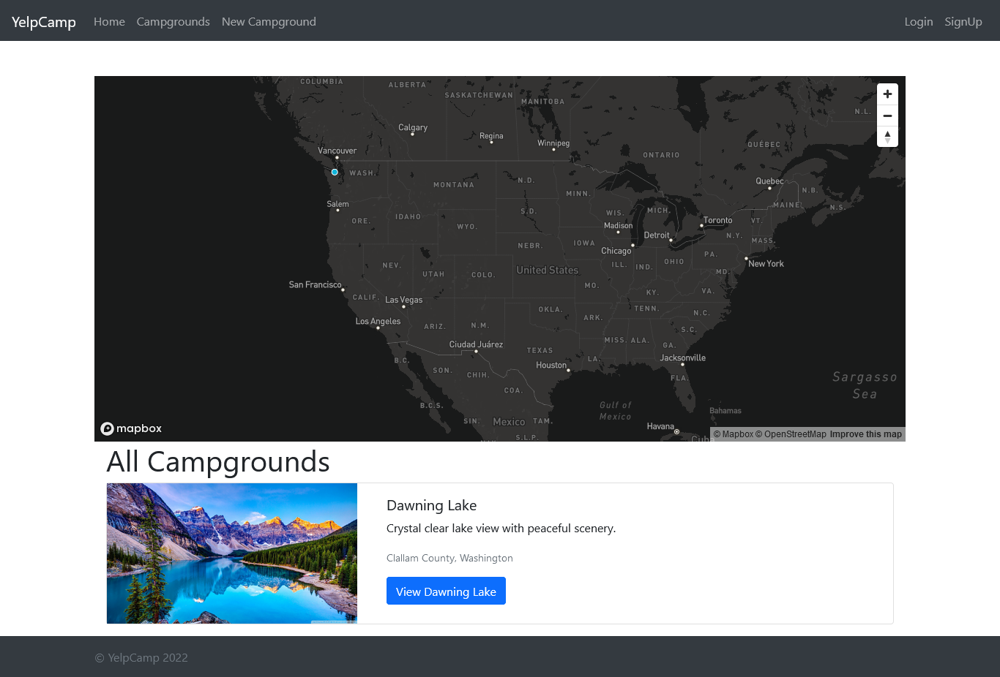

<h1>YelpCamp :camping:</h1>

<h2>A website that allows you to read and leave reviews for camps that you've visited in the United States. It also lets you edit your reviews by registering.</h2>

This website is responsive using Node.js, CSS, JavaScript, and Bootstrap. I created this following the web developer bootcamp of Colt Steele on Udemy. This project uses frontend and backend. I enjoyed building this project. This project uses an API for images.

### Link

- Live Site: [YelpCamp](https://arcane-fortress-76458.herokuapp.com/)

### Screenshot

