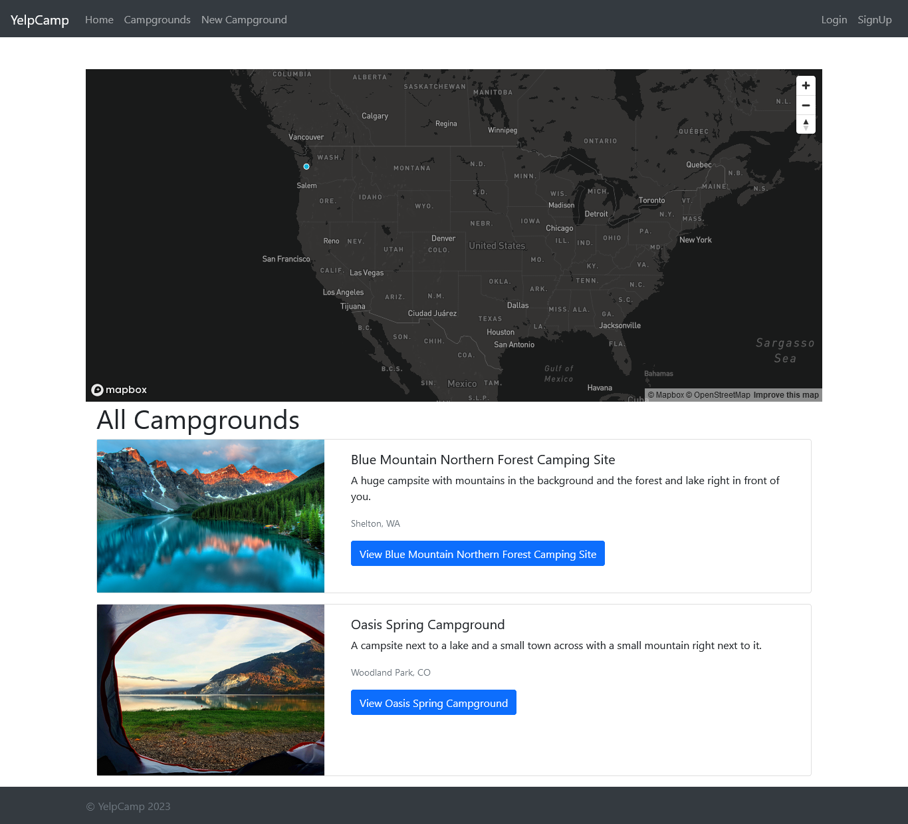
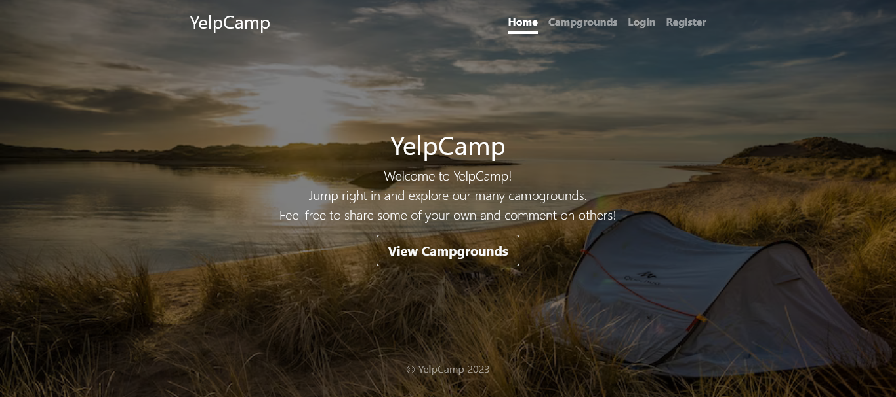
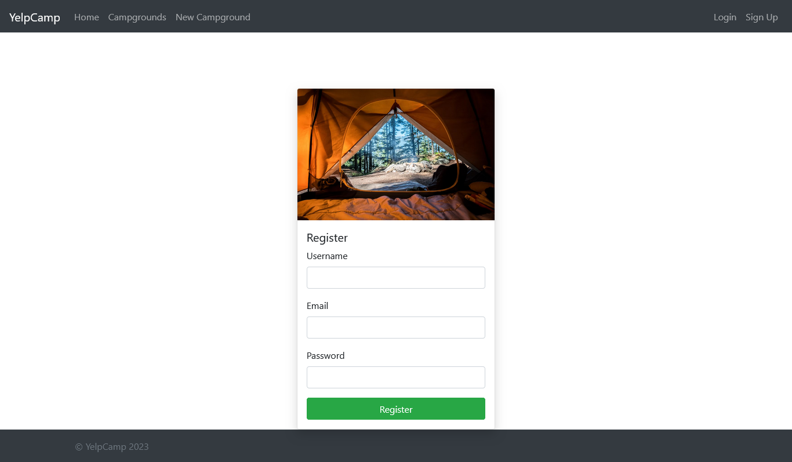

<h1>YelpCamp :camping:</h1>

<h2>YelpCamp is a web platform designed for camping enthusiasts to explore, register, and share their experiences at various campgrounds across the United States. This versatile application not only allows you to create detailed reviews but also offers the convenience of editing your previously posted reviews.</h2>

Features

    Browse: Discover a vast array of campsites with detailed information and stunning visuals.
    Review: Share your experiences by leaving honest reviews and ratings for campsites you've visited.
    Edit: Easily manage and update your reviews to reflect your evolving adventures.
    Responsive Design: Enjoy a seamless experience on all devices, thanks to our responsive design.

Technologies Used

    Frontend: Developed using React, JavaScript, and Bootstrap, providing a sleek and intuitive interface.
    Backend: Powered by Node.js and Express.js, ensuring robust and efficient server-side operations.
    Database: MongoDB serves as our reliable database, storing your valuable reviews and campsite information.
    API Integration: Utilizes external APIs for fetching captivating campsite images, enhancing visual appeal.

How to Use

Getting started with YelpCamp is a breeze:

    Browse: Explore our extensive collection of campsites by navigating through the user-friendly interface.
    Sign Up: Create your personalized account to unlock features like leaving reviews and editing your profile.
    Review: Share your camping experiences by leaving detailed reviews, helping fellow adventurers make informed choices.
    Edit: Modify your reviews anytime to reflect new insights or updates about the campsites you've visited.

 

### Link

- Live Site: [YelpCamp](https://misty-jumpsuit-newt.cyclic.app/)

### Screenshot

---

# Getting Started with Create React App

This project was bootstrapped with [Create React App](https://github.com/facebook/create-react-app).

## Available Scripts

In the project directory, you can run:

### `npm start`

Runs the app in the development mode.\
Open [http://localhost:3000](http://localhost:3000) to view it in your browser.

The page will reload when you make changes.\
You may also see any lint errors in the console.

### `npm test`

Launches the test runner in the interactive watch mode.\
See the section about [running tests](https://facebook.github.io/create-react-app/docs/running-tests) for more information.

### `npm run build`

Builds the app for production to the `build` folder.\
It correctly bundles React in production mode and optimizes the build for the best performance.

The build is minified and the filenames include the hashes.\
Your app is ready to be deployed!

See the section about [deployment](https://facebook.github.io/create-react-app/docs/deployment) for more information.

### `npm run eject`

**Note: this is a one-way operation. Once you `eject`, you can't go back!**

If you aren't satisfied with the build tool and configuration choices, you can `eject` at any time. This command will remove the single build dependency from your project.

Instead, it will copy all the configuration files and the transitive dependencies (webpack, Babel, ESLint, etc) right into your project so you have full control over them. All of the commands except `eject` will still work, but they will point to the copied scripts so you can tweak them. At this point you're on your own.

You don't have to ever use `eject`. The curated feature set is suitable for small and middle deployments, and you shouldn't feel obligated to use this feature. However we understand that this tool wouldn't be useful if you couldn't customize it when you are ready for it.

## Learn More

You can learn more in the [Create React App documentation](https://facebook.github.io/create-react-app/docs/getting-started).

To learn React, check out the [React documentation](https://reactjs.org/).

### Code Splitting

This section has moved here: [https://facebook.github.io/create-react-app/docs/code-splitting](https://facebook.github.io/create-react-app/docs/code-splitting)

### Analyzing the Bundle Size

This section has moved here: [https://facebook.github.io/create-react-app/docs/analyzing-the-bundle-size](https://facebook.github.io/create-react-app/docs/analyzing-the-bundle-size)

### Making a Progressive Web App

This section has moved here: [https://facebook.github.io/create-react-app/docs/making-a-progressive-web-app](https://facebook.github.io/create-react-app/docs/making-a-progressive-web-app)

### Advanced Configuration

This section has moved here: [https://facebook.github.io/create-react-app/docs/advanced-configuration](https://facebook.github.io/create-react-app/docs/advanced-configuration)

### Deployment

This section has moved here: [https://facebook.github.io/create-react-app/docs/deployment](https://facebook.github.io/create-react-app/docs/deployment)

### `npm run build` fails to minify

This section has moved here: [https://facebook.github.io/create-react-app/docs/troubleshooting#npm-run-build-fails-to-minify](https://facebook.github.io/create-react-app/docs/troubleshooting#npm-run-build-fails-to-minify)
